# Hi there! 👋 I'm [Your Name]

🎓 Recent Energy Engineering and Resource Optimization graduate, with a specialization in **Energy Informatics** from [Hochschule Hamm-Lippstadt](https://www.hshl.de/studieren/studiengaenge/bachelorstudiengaenge/energietechnik-und-ressourcenoptimierung).

💡 I enjoy combining my engineering skills with web and IoT development to create innovative solutions for real-world applications and challenges.

🔨 Currently, I'm working as a Software Engineer with a focus on Spring Boot and Java for backend development.

🌐 In the past, I've developed a **Full Stack** Web Application for calculating and ordering tailor-made electromagnets, utilizing Angular for the frontend and Node.js for the backend. It was part of my bachelor's thesis and a project I'm proud of.

📫 How to reach me: <nobr>jan.philipp.klein.96@gmail.com</nobr>

**Languages and Tools:** 

Web&nbsp;&nbsp;
&nbsp;&nbsp;
&nbsp;&nbsp;
&nbsp;&nbsp;
&nbsp;&nbsp;
&nbsp;&nbsp;
&nbsp;&nbsp;
&nbsp;&nbsp;
&nbsp;&nbsp;
&nbsp;&nbsp;

IoT&nbsp;&nbsp;
&nbsp;&nbsp;
&nbsp;&nbsp;
&nbsp;&nbsp;
&nbsp;&nbsp;

Other&nbsp;&nbsp;
&nbsp;&nbsp;
&nbsp;&nbsp;
&nbsp;&nbsp;
&nbsp;&nbsp;
&nbsp;&nbsp;
&nbsp;&nbsp;

<!--
**jaklPhil/jaklPhil** is a ✨ _special_ ✨ repository because its `README.md` (this file) appears on your GitHub profile.
&nbsp;&nbsp;
&nbsp;&nbsp;
Here are some ideas to get you started:

- 
- 🌱 I’m currently learning ...
- 👯 I’m looking to collaborate on ...
- 🤔 I’m looking for help with ...
- 💬 Ask me about ...
- 📫 How to reach me: ...
- 😄 Pronouns: ...
- ⚡ Fun fact: ...
-->
